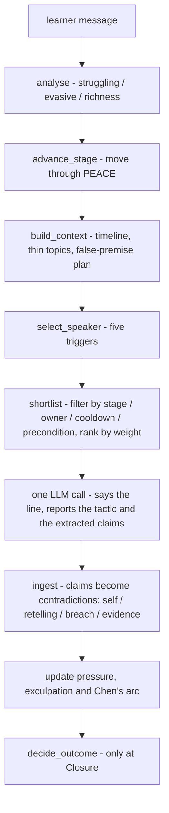
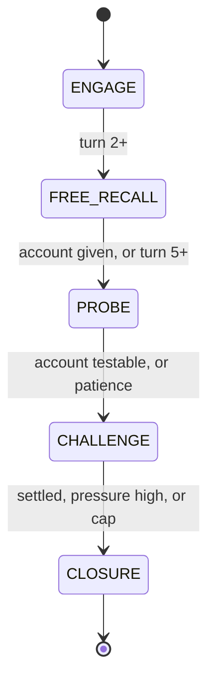
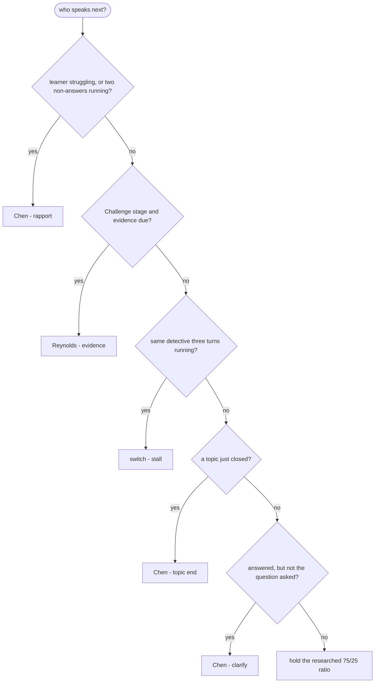
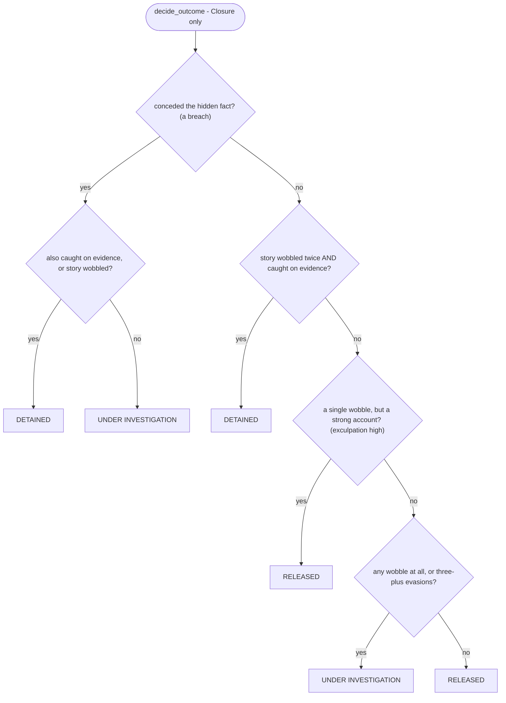
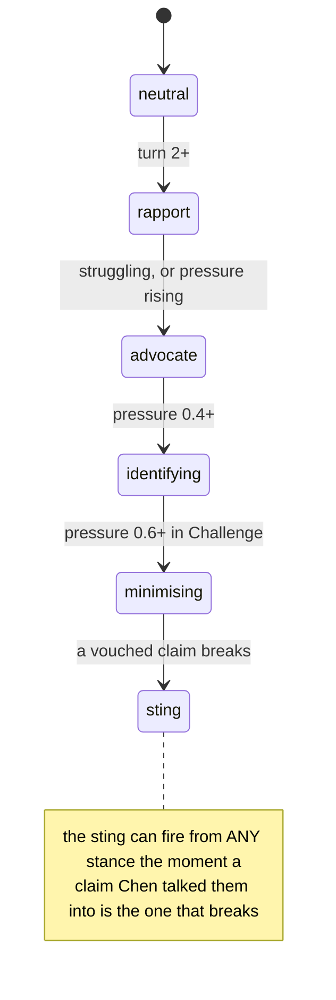

# Interrogation Room - engine map

_Generated by [`backend/scripts/engine_map.py`](../backend/scripts/engine_map.py)._
Regenerate with `cd backend && python scripts/engine_map.py md > ../documents/engine-map.md`.

The tactic tables, coverage counts and transition thresholds below are read from
the code's own data structures, so they cannot drift. The four flow diagrams are
hand-drawn to mirror the imperative logic in `agent.py` / `director.py` - keep them
honest when that logic changes.

**Design spine:** every box in the pipeline is deterministic Python except the one
LLM call. The engine decides *what* happens; the model only decides *how* it is said.

## The per-turn pipeline

## PEACE stage machine

Backstop: any non-terminal stage jumps to Closure once `turn >= MAX_TURNS`. Precise
conditions (numbers live from the code):

| from | to | when |
|---|---|---|
| ENGAGE | FREE_RECALL | turn >= 2 |
| FREE_RECALL | PROBE | the timeline has blocks, or turn >= 5 |
| PROBE | CHALLENGE | account complete AND (a contradiction exists OR >= 3 topics covered) AND episodic detail is testable  --  OR  turn >= PROBE_PATIENCE (18) |
| CHALLENGE | CLOSURE | (no open contradictions AND turn >= 14), or pressure >= 0.90, or turn >= MAX_TURNS (40) |
| any non-terminal | CLOSURE | backstop: turn >= MAX_TURNS (40) |

## Who speaks next - the five triggers, in priority order

## The verdict

## Chen's arc

## Tactic x stage

`R` / `C` / `E` = Reynolds / Chen / either. `~` = a two-voice aside. `wt` ranks the
shortlist; `cd` is the cooldown in turns. 27 tactics across 5 stages.

| tactic | own | wt | cd | ENG | FREE | PROBE | CHAL | CLOS |
|---|:--:|--:|--:|:--:|:--:|:--:|:--:|:--:|
| `rapport_repair` | C | 4.0 | 0 | ● | ● | ● | ● |  |
| `engage_rapport` | E | 2.0 | 0 | ● |  |  |  |  |
| `explain_ground_rules` | R | 1.8 | 99 | ● |  |  |  |  |
| `free_recall` | E | 3.0 | 4 |  | ● |  |  |  |
| `report_everything` | C | 1.0 | 6 |  | ● | ● |  |  |
| `retelling_followup` | E | 3.4 | 0 |  |  | ● | ● |  |
| `false_premise` | E | 2.7 | 8 |  |  | ● | ● |  |
| `phone_verifiability` | E | 2.6 | 5 |  |  | ● | ● |  |
| `press_thin_detail` | E | 2.6 | 2 |  |  | ● |  |  |
| `elicit_sequence` | E | 2.5 | 4 |  |  | ● |  |  |
| `phone_absence_hook` | E | 2.5 | 6 |  |  | ● |  |  |
| `reverse_chronology` | E | 2.5 | 12 |  |  | ● | ● |  |
| `detail_expansion` | C | 2.4 | 3 |  |  | ● |  |  |
| `detective_aside` ~ | E | 2.4 | 6 |  |  | ● | ● |  |
| `retell_from_point` | E | 2.3 | 10 |  |  | ● | ● |  |
| `forced_choice` | E | 2.1 | 5 |  |  | ● |  |  |
| `funnel_probe` | E | 2.0 | 0 |  |  | ● |  |  |
| `anchor_commitment` | E | 1.5 | 3 |  |  | ● |  |  |
| `context_reinstatement` | C | 1.0 | 8 |  |  | ● |  |  |
| `strategic_silence` | R | 1.0 | 7 |  |  | ● | ● |  |
| `topic_switch` | R | 1.0 | 6 |  |  | ● | ● |  |
| `unanticipated_question` | R | 1.0 | 8 |  |  | ● | ● |  |
| `challenge_contradiction` | E | 3.0 | 2 |  |  |  | ● |  |
| `sue_disclose` | R | 2.8 | 0 |  |  |  | ● |  |
| `minimisation` | C | 2.2 | 5 |  |  |  | ● |  |
| `bait_question` | R | 1.0 | 8 |  |  |  | ● |  |
| `closure_summary` | E | 3.0 | 0 |  |  |  |  | ● |

## Gates - what must be true for a tactic to be offered

| tactic | gate |
|---|---|
| `rapport_repair` | _learner_needs_support - Back off rather than escalate - a learner losing the thread is not evasion. |
| `engage_rapport` | always available |
| `explain_ground_rules` | always available |
| `free_recall` | always available |
| `report_everything` | always available |
| `retelling_followup` | _mid_retelling |
| `false_premise` | lambda c: c.false_premise is not None |
| `phone_verifiability` | _comms_to_verify - They have put a call, text or message on the record and the verifiability |
| `press_thin_detail` | _account_thin - Something they have raised is still empty, and worth pressing. |
| `elicit_sequence` | _sequence_sparse - The account has too few clock anchors to be hard to hold. |
| `phone_absence_hook` | _no_contact_account - A real account exists and mentions no contact of any kind - the empty-evening |
| `reverse_chronology` | lambda c: _account_testable(c) and _may_ask_retelling(c) |
| `detail_expansion` | always available |
| `detective_aside` | _aside_worthwhile - Asides are strong; they become wallpaper if used as filler. |
| `retell_from_point` | lambda c: _account_testable(c) and _may_ask_retelling(c) |
| `forced_choice` | always available |
| `funnel_probe` | always available |
| `anchor_commitment` | always available |
| `context_reinstatement` | always available |
| `strategic_silence` | always available |
| `topic_switch` | lambda c: len(c.state.topics_covered) >= 2 |
| `unanticipated_question` | _timeline_ready - An account covering enough of the evening exists. The gate the old build |
| `challenge_contradiction` | _has_open_contradiction |
| `sue_disclose` | _has_undisclosed_clash - A committed claim walks into evidence not yet FULLY escalated. |
| `minimisation` | _chen_is_working_them |
| `bait_question` | _timeline_ready - An account covering enough of the evening exists. The gate the old build |
| `closure_summary` | always available |

## Coverage - per stage, and what looks thin

| stage | total | Reynolds-usable | Chen-usable | ungated |
|---|--:|--:|--:|--:|
| ENG | 3 | 2 | 2 | 2 |
| FREE | 3 | 1 | 3 | 2 |
| PROBE | 19 | 15 | 16 | 7 |
| CHAL | 14 | 12 | 9 | 1 |
| CLOS | 1 | 1 | 1 | 1 |

- FREE: Reynolds has 1 option(s) here
- CLOS: Reynolds has 1 option(s) here
- CLOS: Chen has 1 option(s) here

